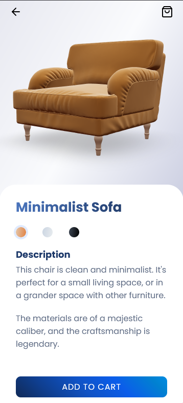

# React Three Fiber simple Furniture product page example in Next.js

[The website](https://nextjs-react-three-fiber-furniture.vercel.app/)

It doesn't resize well because I didn't want to focus on calculating `canvas` resizes, but it should be the proper size on refresh or first load.

None of the actions do anything, either (cart, back button, etc.). This is purely a presentational demo for the 3D model.

Here is a screenshot of the site.

Heads up, the code is a bit of a mess, as this is a quick prototype I threw together in a day.

The tools/tech used:

- [`three.js`](https://github.com/mrdoob/three.js/) - Very popular 3D graphics and animation library.
- [`@react-three/fiber`](https://github.com/pmndrs/react-three-fiber) - A react renderer for Three.js
- [`@react-three/drei`](https://github.com/pmndrs/drei) - helpers for `@react-three/fiber`, such as lighting and draggable controls.
- [Blender](https://www.blender.org/) for modeling (fine-tuning and exporting the models)
- [https://www.blendswap.com/](https://www.blendswap.com/) for finding models
- [`gltf-pipeline`](https://github.com/CesiumGS/gltf-pipeline) to compress the model file (draco 10 for max compression). Usually a 10x reduction in size.
- [`gltfjsx`](https://github.com/pmndrs/gltfjsx) - You can run `npx gltfjsx ./your-file.glb` to output the mesh layers as JSX which saves you a lot of time.
